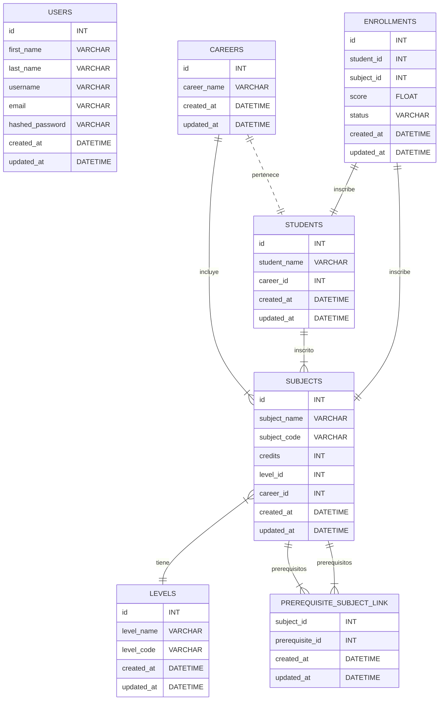

# Solución Prueba técnica 
## Esctructura de la base de datos 
La estructura de la base de datos proporcionada incluye varias entidades y relaciones entre ellas. Aquí hay una descripción de cada una de las entidades y cómo están relacionadas:

1. **EnrollmentModel**:
   - Representa la inscripción de un estudiante en una asignatura.
   - Tiene una relación con los modelos de Student y Subject para almacenar los identificadores de los estudiantes y las asignaturas.
   - Almacena la puntuación obtenida y el estado de la inscripción.
   - Registra la fecha y hora de creación y actualización de la inscripción.

2. **StudentModel**:
   - Representa a los estudiantes en la base de datos.
   - Almacena el nombre del estudiante y el identificador de la carrera en la que está matriculado.
   - Tiene una relación con el modelo de Career para almacenar la información sobre la carrera del estudiante.
   - Tiene una relación con el modelo de Subject para almacenar las asignaturas en las que el estudiante está inscrito.
   - Registra la fecha y hora de creación y actualización del estudiante.

3. **LevelModel**:
   - Representa un nivel educativo o también llamado nivel de semestre.
   - Almacena el nombre y el código del nivel.
   - Registra la fecha y hora de creación y actualización del nivel.

4. **CareerModel**:
   - Representa una carrera académica.
   - Almacena el nombre de la carrera.
   - Tiene una relación con el modelo de Subject para almacenar las asignaturas asociadas con la carrera.
   - Tiene una relación con el modelo de Student para almacenar los estudiantes matriculados en la carrera.
   - Registra la fecha y hora de creación y actualización de la carrera.

5. **PrerequisiteSubjectLink**:
   - Es una tabla de enlace para representar los requisitos previos de una asignatura.
   - Almacena los identificadores de la asignatura y el requisito previo asociado.
   - Registra la fecha y hora de creación y actualización del enlace.

6. **SubjectModel**:
   - Representa una asignatura.
   - Almacena el nombre, el código y el número de créditos de la asignatura.
   - Tiene una relación con el modelo de Level para almacenar el nivel educativo de la asignatura.
   - Tiene una relación con el modelo de Career para almacenar la carrera asociada con la asignatura.
   - Tiene una relación consigo misma para representar los requisitos previos de la asignatura.
   - Registra la fecha y hora de creación y actualización de la asignatura.

### Descripción de las rutas y endpoints de la API:

1. **/students** (prefijo para las rutas relacionadas con estudiantes):
   - **POST /**: Crea un nuevo estudiante en la base de datos.
   - **GET /**: Obtiene una lista de estudiantes de la base de datos.
   - **GET /{student_id}**: Obtiene un estudiante específico por su ID.

2. **/enroll** (prefijo para las rutas relacionadas con matriculas):
   - **POST /**: Crea una nueva inscripción en la base de datos.
   - **GET /**: Obtiene una lista de inscripciones de la base de datos.
   - **GET /students/{student_id}**: Obtiene la lista de asignaturas disponibles para un estudiante basado en su progreso académico y los requisitos previos.
   - **POST /subjects/**: Inscribir a un estudiante en asignaturas específicas proporcionando una lista de IDs de asignaturas.
   - **GET /enrolled/subjects/**: Obtiene la lista de asignaturas en las que un estudiante está inscrito.
   - **PUT /{enrollment_id}/finish/**: Finaliza una asignatura para un estudiante actualizando la puntuación.

3. **/students/approved/** (prefijo para obtener información sobre asignaturas aprobadas por un estudiante):
   - **GET /**: Obtiene la lista de asignaturas aprobadas por un estudiante y su promedio general de puntuación.

4. **/students/disapproved/** (prefijo para obtener información sobre asignaturas reprobadas por un estudiante):
   - **GET /**: Obtiene la lista de asignaturas reprobadas por un estudiante.

### Ejemplos de solicitudes y respuestas de la API:

1. **Crear un nuevo estudiante**:
   - **Solicitud (POST /students/)**:
   * Anteriormente se debe agregar la carrera a la base de datos. 
     ```json
     {
         "student_name": "John Doe",
         "career_id": 1
     }
     ```
   - **Respuesta**:
     ```json
     {
         "id": 1,
         "student_name": "John Doe",
         "career_id": 1,
         "created_at": "2024-02-19T12:00:00",
         "updated_at": "2024-02-19T12:00:00"
     }
     ```

2. **Obtener una lista de estudiantes**:
   - **Solicitud (GET /students/)**.
   - **Respuesta**:
     ```json
     [
         {
             "id": 1,
             "student_name": "John Doe",
             "career_id": 1,
             "created_at": "2024-02-19T12:00:00",
             "updated_at": "2024-02-19T12:00:00"
         },
         {
             "id": 2,
             "student_name": "Jane Smith",
             "career_id": 2,
             "created_at": "2024-02-19T12:00:00",
             "updated_at": "2024-02-19T12:00:00"
         }
     ]
     ```

3. **Obtener asignaturas disponibles para un estudiante**:
   - **Solicitud (GET /enroll/students/{student_id})**.
   - **Respuesta**:
     ```json
     {
         "available_subjects": [
             {
                 "subject": {
                     "id": 1,
                     "subject_name": "Math",
                     "subject_code": "MATH101",
                     "credits": 3,
                     "level_id": 1,
                     "career_id": 1,
                     "created_at": "2024-02-19T12:00:00",
                     "updated_at": "2024-02-19T12:00:00"
                 },
                 "enroll": null,
                 "status": "subject_status.null"
             },
             {
                 "subject": {
                     "id": 2,
                     "subject_name": "Physics",
                     "subject_code": "PHY101",
                     "credits": 4,
                     "level_id": 1,
                     "career_id": 1,
                     "created_at": "2024-02-19T12:00:00",
                     "updated_at": "2024-02-19T12:00:00"
                 },
                 "enroll": {
                     "id": 1,
                     "student_id": 1,
                     "subject_id": 2,
                     "score": null,
                     "status": null,
                     "created_at": "2024-02-19T12:00:00",
                     "updated_at": "2024-02-19T12:00:00"
                 },
                 "status": "null"
             }
         ],
         "count": 2,
         "ids": [1, 2]
     }
     ```

### Instrucciones para ejecutar y probar la API:

Para ejecutar la aplicación utilizando Docker Compose y el Dockerfile proporcionado, sigue estos pasos:

1. Asegúrate de tener instalado Docker y Docker Compose en tu sistema.

2. Crea un archivo llamado `Docker.env` en la carpeta `src` y define las variables de entorno necesarias para la aplicación, como se muestra en tu archivo de composición de Docker.

3. En la raíz de tu proyecto, donde se encuentra el archivo `docker-compose.yml`, crea una carpeta llamada `src` y mueve todos los archivos de tu aplicación (incluido el archivo `requirements.txt`, el `Dockerfile` y los archivos de código fuente) a esta carpeta.

4. Asegúrate de que tu estructura de carpetas se vea así:

   ```
   .
   ├── docker-compose.yml
   └── src
       ├── Dockerfile
       ├── Docker.env
       ├── main.py
       ├── requirements.txt
       └── ...
   ```

5. Abre una terminal y navega a la ubicación donde se encuentra tu archivo `docker-compose.yml`.

6. Ejecuta el siguiente comando para construir y ejecutar los contenedores:

   ```bash
   docker-compose build
   ```
   ```bash
   docker-compose up
   ```


7. Una vez que los contenedores estén en funcionamiento, podrás acceder a tu aplicación en `http://localhost:8000`.

8. Para acceder a PgAdmin, ve a `http://localhost:8888` en tu navegador web. Utiliza el correo electrónico y la contraseña predeterminados definidos en el archivo `Docker.env` para iniciar sesión.

Con estos pasos, deberías poder ejecutar tu aplicación utilizando Docker Compose y el Dockerfile proporcionado. Asegúrate de que los archivos de configuración y los directorios estén estructurados como se indica y de que todas las dependencias estén instaladas correctamente.